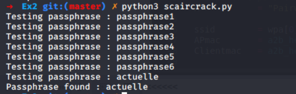

# SWI - Laboratoire 4 - 802.11 Sécurité WPA

## Auteurs: Daniel Oliveira Paiva et Edin Mujkanovic

### Exercice 1 

Le script modifié et commenté est dans le dossier `Ex1` qui se trouve à la racine du repos. 

### Exercice 2

Le script modifié et commenté ainsi que la wordlist `dictionnary` sont dans le dossier `Ex2` qui se trouve à la racine du repos. Ci-dessous, une capture d'écran de exécution du script : 

### 

Comme on peut le voir, il a bien trouvé la passphrase et s'arrête s'il la trouve.